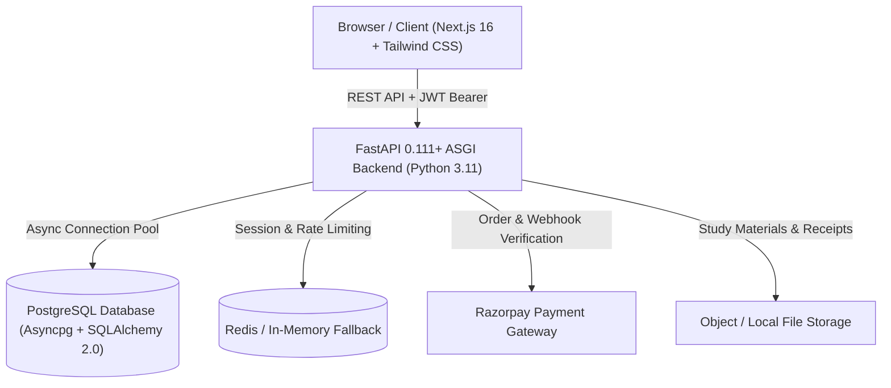

<div align="center">

# 🎓 Aarambh Institute ERP & Coaching Management System

**An enterprise-grade, multi-portal coaching institute ERP and high-converting student portal.**  
Built for modern educational institutes, coaching centers, and schools managing Classes 4th–12th (CBSE, MP Board, ICSE) and Higher Education.

[](https://fastapi.tiangolo.com)
[](https://nextjs.org)
[](https://www.postgresql.org)
[-D71F00.svg?style=flat&logo=sqlalchemy&logoColor=white)](https://www.sqlalchemy.org)
[](https://tailwindcss.com)
[](https://render.com)
[](https://vercel.com)
[](https://opensource.org/licenses/MIT)

[Live Demo](#-live-deployment) • [Architecture](#-architecture) • [Features](#-key-features) • [Deployment](#-deployment-guide) • [Getting Started](#-getting-started-locally)

</div>

---

## 📌 Overview

**Aarambh Institute ERP** is an end-to-end institutional platform combining a high-performance public landing page with four tightly unified role-based portals: **Admin**, **Teacher**, **Student**, and **Parent**.

Rather than disjointed sub-apps, Aarambh ERP is designed around a single student lifecycle: from initial enquiry and admission, through batch allocations, daily attendance, homework, exams, and an immutable fee ledger with Razorpay online checkout.

---

## 🏗️ Architecture



### System Slices & Design Backbone
- **Unified Academic Backbone**: `Board` ➔ `SchoolClass` ➔ `Stream` ➔ `Course` ➔ `Subject` ➔ `Batch` ➔ `Enrollment` ➔ `Student`.
- **Stateless Authentication**: Cryptographically signed Argon2 password hashing and RS256/HS256 JWT tokens.
- **Double-Entry Financial Ledger**: Immutable fee transactions, receipt numbering, online installment payments.
- **High-Converting Public Website**: Integrated Dynamic CMS for instant updates to courses, faculty, announcements, and trust metrics without code changes.

---

## ✨ Key Features

### 1. 🌐 Public Website & Admin Dynamic CMS
- **Modern Responsive Design**: Fast-loading landing page with faculty profiles, course directory, board results, testimonials, and FAQ.
- **Lead Capture Pipeline**: Public enquiry form linked directly to the Admin CRM admissions board.
- **Live Content Management**: Admin can edit institute contact info, banner announcements, testimonials, and course offerings with instant sync.

### 2. 🏛️ Admin Management Portal
- **Academic Structure Manager**: Create and organize boards, grades, streams, subjects, and batch rosters.
- **Student & Staff Directory**: Complete profile records, enrollment history, and teacher assignment.
- **Fee Management & Invoicing**: Configure installment plans, issue digital receipts, and track collection analytics.
- **Audit Logs & Telemetry**: Full traceability across academic and financial actions.

### 3. 👩‍🏫 Teacher Workspace
- **Daily Attendance Marking**: One-click batch attendance (Present, Absent, Late, Excused) with history.
- **Homework & Study Material**: Upload assignments and study notes tagged by subject and batch.
- **Exam Grading & Remarks**: Record test marks, submit qualitative feedback, and identify students needing attention.

### 4. 🎒 Student & Parent Portals
- **Real-Time Attendance Monitoring**: Detailed monthly percentage charts and daily status breakdowns.
- **Exams & Report Cards**: Complete test score records and downloadable performance summaries.
- **Online Fee Payments**: Razorpay integration allowing one-click UPI/card installment payments with instant PDF receipt download.
- **Direct Noticeboard**: Batched academic announcements and homework reminders.

---

## 💻 Tech Stack

| Domain | Technology | Description |
| :--- | :--- | :--- |
| **Frontend Framework** | [Next.js 16 (App Router)](https://nextjs.org) | Server and Client Components with TypeScript |
| **Styling & UI** | [Tailwind CSS v4](https://tailwindcss.com), [Lucide React](https://lucide.dev) | High-performance responsive UI |
| **Backend Framework** | [FastAPI](https://fastapi.tiangolo.com) (Python 3.11+) | Asynchronous high-throughput ASGI REST API |
| **Database & ORM** | [PostgreSQL](https://postgresql.org) + [SQLAlchemy 2.0](https://sqlalchemy.org) | Fully async database layer powered by `asyncpg` |
| **Schema Migrations** | [Alembic](https://alembic.sqlalchemy.org) | 12 automated migration slices from identity to ledger |
| **Authentication** | [Pwdlib (Argon2)](https://github.com/Frank-S-Kaminski/pwdlib) + [PyJWT](https://pyjwt.readthedocs.io) | Zero-trust role-based access control (RBAC) |
| **Payments** | [Razorpay SDK](https://razorpay.com/docs/payments/server-integration/python/) | Orders API, checkout modal & webhook verification |
| **Deployment** | [Render](https://render.com) (Backend + DB), [Vercel](https://vercel.com) (Frontend) | Automated CI/CD via Infrastructure-as-Code Blueprint |

---

## 🚀 Getting Started Locally

### Prerequisites
- **Node.js** 18+ & `npm`
- **Python** 3.11+
- **PostgreSQL** 14+ (or a free cloud database on [Neon](https://neon.tech))

---

### 1. Backend Setup

```bash
# Navigate to backend
cd backend

# Create virtual environment
python -m venv .venv

# Activate virtual environment
# Windows:
.venv\Scripts\activate
# Linux/macOS:
source .venv/bin/activate

# Install dependencies
pip install -r requirements.txt

# Configure environment
cp .env.example .env
# Open .env and adjust DATABASE_URL and SECRET_KEY

# Run database migrations
alembic upgrade head

# Seed initial institute data, sample teachers, and admin account
python -m app.db.seed_aarambh

# Start development server
uvicorn app.main:app --reload --port 8000
```
Backend API interactive documentation will be live at: `http://localhost:8000/docs`

---

### 2. Frontend Setup

```bash
# Navigate to frontend (in a separate terminal)
cd frontend

# Install dependencies
npm install

# Configure environment variables
cp .env.example .env.local
# Default NEXT_PUBLIC_API_URL is already http://127.0.0.1:8000

# Start development server
npm run dev
```
Open your browser at `http://localhost:3000`.

---

## 🔑 Default Credentials (Development & Testing)

| Role | Email | Password |
| :--- | :--- | :--- |
| **Admin** | `admin@aarambhinstitute.com` | `AarambhAdmin@2026` |
| **Teacher** | `pankaj.dubey@aarambhinstitute.com` | `AarambhTeacher@2026` |

*(Note: Change passwords immediately in production via the security settings!)*

---

## ☁️ Deployment Guide

### Deploying to Render & Vercel

The repository includes ready-to-use production configuration files:
- **`render.yaml`**: One-click Render Blueprint that provisions both PostgreSQL and FastAPI with automatic Alembic migrations.
- **`frontend/vercel.json`**: Pre-configured Vercel configuration with security headers and Next.js presets.

#### 1. Backend on Render (1-Click Blueprint)
1. Push this repository to GitHub.
2. Go to [Render Dashboard](https://dashboard.render.com) ➔ **New +** ➔ **Blueprint**.
3. Connect your repository. Render will automatically detect [`render.yaml`](./render.yaml).
4. Click **Apply**.
5. Once live, open the **Shell** tab on `aarambh-erp-backend` and seed data:
   ```bash
   python -m app.db.seed_aarambh
   ```

#### 2. Frontend on Vercel
1. Go to [Vercel Dashboard](https://vercel.com) ➔ **Add New...** ➔ **Project**.
2. Select your repository.
3. In **Root Directory**, select `frontend`.
4. Add environment variable:
   - `NEXT_PUBLIC_API_URL` = `https://<YOUR-RENDER-SERVICE>.onrender.com`
5. Click **Deploy**.

For detailed instructions, troubleshooting, and production checklists, refer to **[DEPLOYMENT.md](./DEPLOYMENT.md)**.

---

## 📁 Repository Structure

```text
.
├── render.yaml                    # Infrastructure-as-Code Blueprint for Render
├── DEPLOYMENT.md                  # Comprehensive production deployment manual
├── backend/
│   ├── alembic/                   # Database migrations (12 domain slices)
│   ├── app/
│   │   ├── api/v1/                # Versioned REST API endpoints
│   │   │   ├── admin/             # CMS, academic, admissions, people routes
│   │   │   ├── operations/        # Attendance, sessions, timetables
│   │   │   ├── learning/          # Homework, study materials, files
│   │   │   ├── examination/       # Questions, tests, results
│   │   │   ├── finance/           # Fee ledger & Razorpay payments
│   │   │   └── communication/     # Notices & announcements
│   │   ├── core/                  # Security, config, lifespan, exceptions
│   │   ├── db/                    # Async engine, sessionmaker, seed scripts
│   │   ├── models/                # SQLAlchemy ORM database models
│   │   ├── schemas/               # Pydantic validation schemas
│   │   └── services/              # Pure business logic layer
│   ├── pyproject.toml             # Python packaging configuration
│   └── requirements.txt           # Production dependencies for cloud deployment
└── frontend/
    ├── src/
    │   ├── app/                   # Next.js App Router (Public, Admin, Teacher, Student, Parent)
    │   ├── components/            # Reusable UI components & landing page sections
    │   ├── lib/                   # API clients, auth token manager, Razorpay loader
    │   └── types/                 # Shared TypeScript interfaces
    ├── vercel.json                # Vercel deployment configuration & security headers
    ├── next.config.ts             # Next.js production settings
    └── package.json               # Node.js dependencies & scripts
```

---

## 📄 License

This project is licensed under the MIT License — see the [LICENSE](LICENSE) file for details.

---

<div align="center">
  <b>Built with ❤️ for Aarambh Institute</b> • <i>Step Toward Success</i>
</div>
