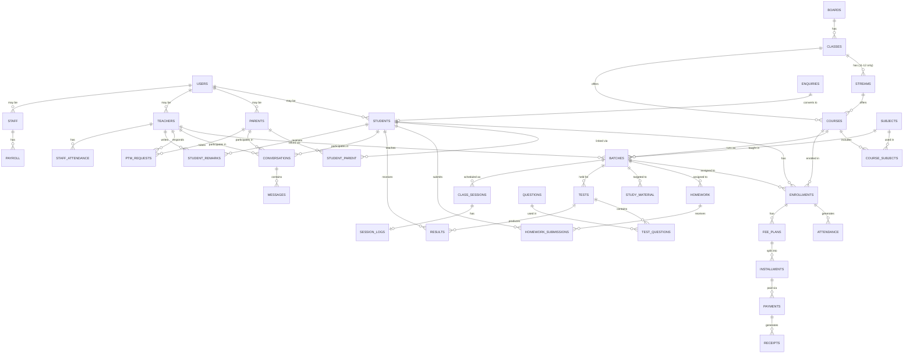

# Aarambh ERP — System & Data Design

Companion to `architecture.md`. This document defines entities, relationships, state
machines, and API surface derived from the spec.

## 1. Entity-Relationship Overview

## 2. Core Tables — Key Fields

### Academic backbone
- `boards` — id, name (CBSE / MP Board / ICSE)
- `classes` — id, board_id, name (Class 8–12)
- `streams` — id, class_id, name (PCM/PCB/Commerce/Arts) — Classes 11–12 only
- `courses` — id, class_id, stream_id (nullable), name, academic_year, duration,
  description, fee_structure_id, is_active
- `subjects` — id, name
- `course_subjects` — course_id, subject_id (join table)
- `batches` — id, course_id, subject_id, teacher_id, timing, days[], room, capacity,
  start_date, is_active
- `enrollments` — id, student_id, course_id, batch_id, status (active/paused/ended/
  transferred), start_date, end_date, created_from_enrollment_id (self-ref for transfer
  chains so history is preserved — spec §17)

### People
- `users` — id, email/mobile, password_hash, role, is_active
- `students` — id, user_id, full_name, photo_url, dob, gender, mobile, email, address,
  school, student_code, roll_number
- `parents` — id, user_id, full_name, mobile, email
- `student_parent` — student_id, parent_id, relation (father/mother/guardian)
- `teachers` — id, user_id, full_name, photo_url, mobile, email, qualification,
  experience_years, joining_date
- `staff` — id, user_id, full_name, staff_type (teacher/accountant/receptionist/
  counsellor/coordinator/support), joining_date

### Remarks
- `student_remarks` — id, student_id, teacher_id, body, visible_to_parent, created_at
  (Teacher "Student Remarks" — spec §45; surfaced in Parent "Academic Progress" — spec
  §65 — only when `visible_to_parent` is enabled per the institute setting, `rules.md` §5)

### Admissions
- `enquiries` — id, student_name, parent_name, parent_mobile, class_id, board_id,
  interested_course_id, school, source, assigned_counsellor_id, follow_up_date, notes,
  stage (new/contacted/counselling/demo/interested/admission/not_interested/
  follow_up_later)

### Attendance & operations
- `class_sessions` — id, batch_id, date, start_time, end_time, room, status
  (scheduled/held/cancelled/rescheduled)
- `session_logs` — id, class_session_id, topic, topics_covered, homework_notes,
  class_remarks, created_by, created_at (Teacher "Daily Session Log" — spec §38)
- `attendance` — id, class_session_id, enrollment_id, status (present/absent/late),
  marked_by, marked_at
- `staff_attendance` — id, staff_id, date, status (present/absent/late/leave)
- `payroll` — id, staff_id, month, basic_salary, incentives, bonus, deductions, final,
  payment_status, payment_date

### Homework, study material, exams
- `homework` — id, batch_id, subject_id, title, instructions, chapter, due_date,
  attachment_url, created_by
- `homework_submissions` — id, homework_id, student_id, attachment_url, status
  (submitted/late/reviewed/needs_improvement/resubmit), teacher_comment, marks,
  submitted_at, reviewed_at
- `study_material` — id, title, type (notes/pdf/dpp/worksheet/video/important_questions/
  revision/classwork), target_board_id, target_class_id, target_subject_id,
  target_course_id, target_batch_id, file_url, uploaded_by
- `tests` — id, name, course_id, batch_id, subject_id, date, duration_minutes,
  max_marks, type (class/chapter/unit/monthly/half_yearly/pre_board/mock/special), status
- `questions` — id, board_id, class_id, stream_id, subject_id, chapter, topic,
  difficulty (easy/medium/hard), body, question_type (objective/subjective)
- `test_questions` — test_id, question_id, marks
- `results` — id, test_id, student_id, marks_obtained, published_at

### Fees
- `fee_plans` — id, enrollment_id, total_amount, plan_type (lump_sum/installment),
  discount, scholarship
- `installments` — id, fee_plan_id, amount, due_date, status (upcoming/due/paid/overdue)
- `payments` — id, installment_id, amount, method (cash/upi/bank_transfer/card/online),
  paid_at, recorded_by — **append-only, never edited in place** (see `rules.md` §6)
- `receipts` — id, payment_id, receipt_number, pdf_url, generated_at

### Communication
- `conversations` — id, type (student_teacher/parent_teacher/three_way/batch_group),
  batch_id (nullable, for batch groups)
- `conversation_participants` — conversation_id, user_id, role_in_conversation
- `messages` — id, conversation_id, sender_id, body, attachment_url, sent_at, read_by[]
- `announcements` — id, title, body, audience_filter (json: board/class/course/batch/
  all_students/all_parents/teachers), created_by, sent_at
- `ptm_requests` — id, parent_id, student_id, teacher_id, reason, requested_slot,
  status (requested/approved/rejected/rescheduled/confirmed/completed)
- `notifications` — id, user_id, type, body, related_entity, read_at
- `reported_messages` — id, message_id, reported_by, reason, status

## 3. Key Business Rules / Invariants (from spec)

1. A student can hold **multiple simultaneous enrollments** (course+batch pairs) — spec §3.
2. Enrollment history (attendance, results) survives batch transfer — never deleted, only
   superseded via `created_from_enrollment_id` — spec §17.
3. Admission completion is **one atomic transaction**: student record + Student ID + Roll
   Number + enrollment + course/batch link + parent link + fee record + student login +
   parent login — spec §10. Implement as a single DB transaction with rollback on any failure.
4. Chat participant eligibility is **computed from live enrollment data**, not a stored
   contact list — spec §71, §84.
5. Payments/receipts are append-only; corrections are new adjustment records.

## 4. State Machines

**Enquiry** (spec §9):
`New → Contacted → Counselling → Demo → Interested → Admission`
alternative terminal states: `Not Interested`, `Follow-up Later`

**Homework submission** (spec §40, §52):
`Assigned → Submitted (or Late) → Reviewed | Needs Improvement | Resubmit`

**PTM request** (spec §68, §89):
`Requested → Approved | Rejected | Rescheduled → Confirmed → Completed`

**Installment** (spec §28, §66):
`Upcoming → Due → Paid | Overdue`

**Class session** (spec §18):
`Scheduled → Held | Cancelled | Rescheduled` (reschedule creates a new session,
old one marked `Rescheduled` and linked for audit history)

## 5. Reporting Design

Dashboard aggregates (spec §8, §31) are expensive if computed live on every page load:

- Attendance %, fee collection totals, batch performance averages are refreshed via a
  scheduled job (or Postgres materialized view refreshed every few minutes) rather than
  computed synchronously in the request path.
- Per-enrollment `attendance_percentage` can be denormalized and updated via a background
  job/trigger after each attendance-marking event, to make student-profile and dashboard
  reads O(1) instead of aggregating raw attendance rows each time.

## 6. Indexing Strategy

- FK columns: `enrollments.student_id`, `enrollments.batch_id`, `attendance.enrollment_id`,
  `homework_submissions.student_id`, `payments.installment_id`
- Composite: `(batch_id, date)` on `class_sessions`, `(enrollment_id, status)` on
  `installments`, `(conversation_id, sent_at)` on `messages`
- Search: trigram/GIN index on `students.full_name`, `students.student_code`,
  `students.roll_number`, `students.mobile` (spec §11 search requirements)

## 7. API Surface Overview (by portal)

- `/api/v1/auth/*` — login, refresh, logout, forgot-password
- `/api/v1/admin/*` — full CRUD across all modules
- `/api/v1/teacher/*` — scoped to own batches: attendance, homework, study material,
  tests, marks, student remarks, messages
- `/api/v1/student/*` — read-mostly: courses, schedule, study corner, homework,
  submissions, tests, results, performance, attendance, notices, messages
- `/api/v1/parent/*` — read-mostly, scoped to own children: attendance, timetable,
  homework, tests/results, progress, fees, receipts, communication, PTM

## 8. Scalability Notes

- Read replica for reporting queries once write volume grows.
- Redis cache in front of dashboard aggregate endpoints (see `codeoptimisation.md`).
- Background jobs (Celery/RQ) for: fee reminder generation, bulk announcement fan-out,
  receipt PDF generation, nightly report aggregation.
